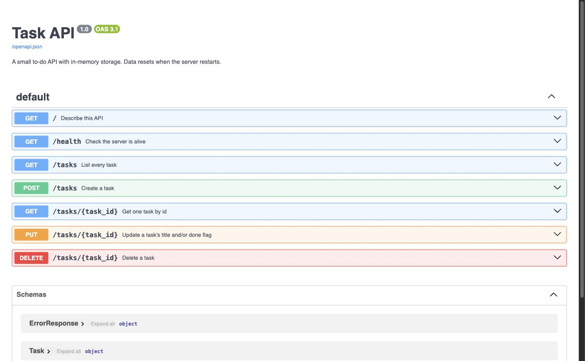

# Task API

A small to-do API built with FastAPI. It supports the four CRUD operations (create, read, update,
delete) over a list of tasks, and documents itself with Swagger UI.

Storage is **in memory**: the tasks live in a Python list, not a database. Everything you create is
lost when the server stops. That is deliberate. See [Where the data goes](#where-the-data-goes).

A task looks like this:

```json
{ "id": 1, "title": "Read the assignment", "done": false }
```

## Install and run

Requires Python 3.10 or newer.

```bash
python3 -m venv .venv && .venv/bin/pip install -r requirements.txt
```

Then start the server with one command:

```bash
.venv/bin/uvicorn main:app --reload --port 8001
```

The API is now at `http://localhost:8001` and the interactive docs are at
`http://localhost:8001/docs`.

Port 8001 is used because another program on the development machine already listens on 8000. Any
free port works, so use `--port 8000` if you prefer the FastAPI default.

## Endpoints

| Method | Path | What it does | Success | Errors |
|---|---|---|---|---|
| GET | `/` | Describe this API | 200 | |
| GET | `/health` | Check the server is alive | 200 | |
| GET | `/tasks` | List tasks | 200 | 400 bad query |
| GET | `/tasks/{id}` | Get one task | 200 | 404 unknown id |
| POST | `/tasks` | Create a task | 201 | 400 missing or empty title |
| PUT | `/tasks/{id}` | Update a task's title and/or done | 200 | 400 empty body, 404 unknown id |
| DELETE | `/tasks/{id}` | Delete a task | 204 (no body) | 404 unknown id |
| GET | `/stats` | Count tasks by state | 200 | |
| POST | `/reset` | Restore the three example tasks | 200 | |

Every error returns JSON in one shape, so a client only ever parses one thing:

```json
{ "error": "Task 99 not found" }
```

### Filtering and searching

`GET /tasks` takes two optional query parameters, and they combine:

| Request | Returns |
|---|---|
| `/tasks?done=true` | only finished tasks |
| `/tasks?search=milk` | tasks whose title contains "milk", case-insensitive |
| `/tasks?done=false&search=api` | unfinished tasks matching "api" |

### Validation rules

The server never trusts the client:

- `title` must be present and must not be empty or only whitespace.
- `PUT` needs at least one of `title` or `done`; an empty body `{}` is rejected.
- A bad value anywhere (`?done=maybe`, `/tasks/abc`) is a 400, and the message names the offending
  parameter.

## A real request cycle

Pasted verbatim from a terminal, showing the full create, read, update, delete cycle and both error
codes:

```console
$ curl -i -X POST http://localhost:8001/tasks -H "Content-Type: application/json" -d '{"title":"Buy milk"}'
HTTP/1.1 201 Created
date: Fri, 17 Jul 2026 01:29:48 GMT
server: uvicorn
content-length: 40
content-type: application/json

{"id":4,"title":"Buy milk","done":false}

$ curl -i http://localhost:8001/tasks/4
HTTP/1.1 200 OK
date: Fri, 17 Jul 2026 01:29:48 GMT
server: uvicorn
content-length: 40
content-type: application/json

{"id":4,"title":"Buy milk","done":false}

$ curl -i -X PUT http://localhost:8001/tasks/4 -H "Content-Type: application/json" -d '{"done":true}'
HTTP/1.1 200 OK
date: Fri, 17 Jul 2026 01:29:48 GMT
server: uvicorn
content-length: 39
content-type: application/json

{"id":4,"title":"Buy milk","done":true}

$ curl -i -X DELETE http://localhost:8001/tasks/4
HTTP/1.1 204 No Content
date: Fri, 17 Jul 2026 01:29:48 GMT
server: uvicorn

$ curl -i http://localhost:8001/tasks/4
HTTP/1.1 404 Not Found
date: Fri, 17 Jul 2026 01:29:48 GMT
server: uvicorn
content-length: 28
content-type: application/json

{"error":"Task 4 not found"}

$ curl -i -X POST http://localhost:8001/tasks -H "Content-Type: application/json" -d '{}'
HTTP/1.1 400 Bad Request
date: Fri, 17 Jul 2026 01:29:48 GMT
server: uvicorn
content-length: 56
content-type: application/json

{"error":"Invalid request body: 'title' Field required"}
```

## Swagger UI

FastAPI generates an OpenAPI description from the code, and Swagger UI turns it into a page where
every endpoint has a "Try it out" button that sends a real request. Open
`http://localhost:8001/docs`:



## Where the data goes

The experiment: create two tasks, stop the server, start it again, and ask for the list.

```console
$ curl -s http://localhost:8001/tasks   # before restart
[... ,{"id":4,"title":"Survive the restart","done":false},{"id":5,"title":"Remember me","done":false}]

$ curl -s http://localhost:8001/tasks   # after restart
[{"id":1,"title":"Read the assignment","done":true},{"id":2,"title":"Build the Task API","done":false},{"id":3,"title":"Push to GitHub","done":false}]
```

Both new tasks were gone and the list was back to the three examples. The tasks only ever lived in a
Python list inside the running process, so stopping the process freed that memory and the next start
rebuilt the list from the hardcoded examples. Nothing was written to disk, so there was nothing to
read back.

This is exactly the problem a database solves: it keeps data somewhere that outlives the process.

## How it is built

Everything is in `main.py`, roughly 200 lines, in reading order:

1. `SEED` and `TASKS`, the in-memory store.
2. The Pydantic models, which define what a valid request looks like.
3. Two exception handlers, which are the only non-obvious part of the file. FastAPI reports errors
   as `{"detail": ...}` and rejects invalid input with a 422, but this API promises `{"error": ...}`
   and a 400. The handlers translate between the two.
4. The route handlers, one per endpoint.
